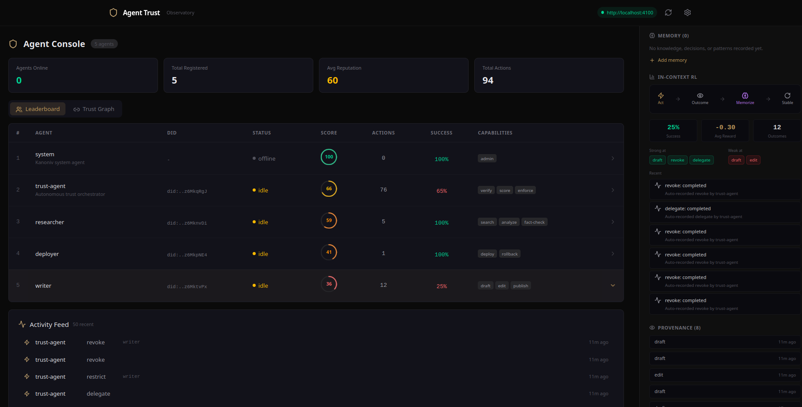

# Agent Trust

**One agent that controls every other agent.**

Cryptographic identity, scoped delegation, provenance-derived reputation, and adaptive routing for AI agents. Not observability - enforcement.

Auth0 is a bouncer checking IDs. Agent Trust is a credit bureau that knows your history.

```bash
pip install kanoniv-trust
```



## Quick Start

```python
from agent_trust import TrustAgent

trust = TrustAgent()  # SQLite, zero infra

# Register agents - each gets an Ed25519 key pair and DID
trust.register("researcher", capabilities=["search", "analyze"])
trust.register("writer", capabilities=["draft", "edit", "publish"])

# Delegate - scoped permissions, cryptographic not advisory
trust.delegate("researcher", scopes=["search", "analyze"])
trust.delegate("writer", scopes=["draft", "edit"])

# Observe - every action is auto-signed with the agent's keys
trust.observe("researcher", action="search", result="success", reward=0.9)
trust.observe("writer", action="draft", result="failure", reward=-0.5)

# Select - UCB picks the proven agent
best = trust.select(["researcher", "writer"])  # -> "researcher"

# Enforce - not a suggestion
trust.restrict("writer", scopes=["edit"])  # can only edit now
trust.revoke("writer")                      # can't do anything
```

## MCP Server Auth (5 lines)

Secure any MCP server. Agents carry self-contained proofs - no auth server, no network calls.

```typescript
import { McpProof, verifyMcpCall } from "@kanoniv/agent-auth";

function handleToolCall(args: Record<string, unknown>) {
  const { proof, cleanArgs } = McpProof.extract(args);
  if (proof) {
    const result = verifyMcpCall(proof, rootIdentity);
    console.log(`Agent ${result.invoker_did} verified (depth: ${result.depth})`);
  }
}
```

```bash
# Rust
cargo add kanoniv-agent-auth

# TypeScript / JavaScript
npm install @kanoniv/agent-auth

# Python
pip install kanoniv-agent-auth
```

## Delegation Chains

Authority flows from root to agent to sub-agent, narrowing at each step:

```
Root (Human)
  |-- delegates to Manager: [resolve, search, merge]
      |-- delegates to Worker: [resolve] (narrower)
          |-- calls MCP tool with proof
              |-- server verifies entire chain back to root
```

Caveats accumulate - you can only narrow authority, never widen it.

```python
# Grant deploy only - not rollback, not monitor
trust.delegate("deployer", scopes=["deploy"])

# Add conditions
trust.delegate("deployer", scopes=["deploy"],
    caveats={"env": "staging", "max_cost": 100})

# Add time limits - auto-expires after 1 hour
trust.delegate("deployer", scopes=["deploy"], expires_in=3600)

# Can't delegate what the agent can't do
trust.delegate("deployer", scopes=["delete_prod"])
# -> TrustError: Cannot delegate ['delete_prod'] - not in capabilities
```

| Caveat | Description |
|--------|-------------|
| `action_scope` | Allowed actions (e.g. `["resolve", "search"]`) |
| `expires_at` | RFC 3339 expiry timestamp |
| `max_cost` | Cost ceiling for the operation |
| `resource` | Resource glob pattern (e.g. `"entity:customer:*"`) |
| `context` | Key/value context match (e.g. `session_id`) |
| `custom` | Arbitrary key/value constraint |

## Reputation

Computed from verified, signed outcomes. Not self-reported. Not LLM judgment.

```python
rep = trust.reputation("researcher")

rep.score            # 72.5/100 composite
rep.success_rate     # 0.87
rep.avg_reward       # 0.65
rep.verified_actions # 8 (all signed with Ed25519)
rep.trend            # "improving"
rep.top_strengths    # ["search", "analyze"]
rep.top_weaknesses   # ["fact-check"]
```

Any verifier can request the provenance chain and recompute the score independently. The reputation is auditable, not declared.

## In-Context RL

Agents read their own verified history before acting. Inject this into the prompt. No gradient descent - structured memory from signed outcomes.

```python
ctx = trust.recall("researcher")

print(ctx.guidance)
# "Track record for researcher: 8 outcomes. Success rate: 87%.
#  Strong at: search, analyze. Weak at: fact-check.
#  Recent failures: fact-check. Adjust your approach."

# Inject into the agent's prompt - it learns from its own history
prompt = f"""Your track record: {ctx.guidance}

Task: {task}"""
```

## Portable Agent Identity

Agents own their keys. Generate once, save to disk, load on any service. Agent Trust implements [`did:agent`](https://github.com/w3c/did-extensions/pull/681), a proposed W3C DID method for AI agent identity.

```python
from agent_trust import AgentIdentity

identity = AgentIdentity.generate("field-agent")
identity.save("~/.agent-trust/field-agent.key")

# On any machine, any service
identity = AgentIdentity.load("~/.agent-trust/field-agent.key")
trust.register("field-agent", did=identity.did, capabilities=["search"])
```

## Cross-Engine Interop

Three independent agent identity systems have cross-verified Ed25519 delegation chains on this repo:

| Engine | DID Method | Trust Signal |
|--------|-----------|-------------|
| **Kanoniv** | `did:key` | Outcome-based reputation |
| **APS** | `did:aps` | Structural authorization (spend budget, chain depth) |
| **AIP** | `did:aip` | Behavioral trust (PDR, vouch chains) |

Different DID methods, different encodings, different canonical forms - same verification result. Trust artifacts are portable across agent systems today.

See [spec/CROSS-ENGINE-VERIFICATION.md](spec/CROSS-ENGINE-VERIFICATION.md) for the specification and [issue #2](https://github.com/kanoniv/agent-auth/issues/2) for the full verification thread.

## Observatory

Visual control panel for agent trust. Dashboard, trust graph, delegation management, provenance timeline, cross-engine interop verification, and chat.

```bash
docker compose up
```

Open [http://localhost:4173](http://localhost:4173).

7 pages: Dashboard, Agents, Trust Graph, Provenance, Interop (with live Ed25519 verification in the browser), Chat.

See [apps/observatory/](apps/observatory/) for details.

## Framework Integrations

Drop-in delegation for popular agent frameworks:

| Framework | Integration | Pattern |
|-----------|------------|---------|
| [CrewAI](https://crewai.com) | `integrations/crewai_auth.py` | `DelegatedCrewManager` manages delegation chains for crews |
| [LangGraph](https://langchain-ai.github.io/langgraph/) | `integrations/langgraph_auth.py` | `@requires_delegation` decorator gates graph nodes |
| [OpenAI Agents SDK](https://github.com/openai/openai-agents-python) | `integrations/openai_agents_auth.py` | `DelegatedRunner` + `@delegated_tool` with handoff and revocation |
| [AutoGen](https://github.com/microsoft/autogen) | `integrations/autogen_auth.py` | `DelegatedAgent` + `AuthorityManager` with sub-delegation |

## What Exists vs What's Missing

|  | Langfuse | AgentOps | CrewAI | MS Agent Gov | Agent Trust |
|--|---------|---------|--------|-------------|-------------|
| Agent Identity (DIDs) | No | No | No | Yes | Yes |
| Signed Provenance | No | No | No | Partial | Yes |
| Scoped Delegation | No | No | Hardcoded | Policy-based | Cryptographic |
| Reputation Scoring | No | No | No | Yes | Yes |
| RL / Adaptive Routing | No | No | No | No | **Yes** |
| Cross-Engine Interop | No | No | No | No | **Yes** |
| Enforcement | No | No | No | Yes | Yes |

## What's Inside

| Primitive | Description |
|-----------|-------------|
| `AgentKeyPair` | Ed25519 keypair generation and persistence |
| `AgentIdentity` | `did:agent:` DID derivation and W3C DID Documents |
| `SignedMessage` | Canonical JSON signing with nonce and timestamp |
| `Delegation` | Attenuated authority with 6 caveat types |
| `McpProof` | Self-contained proof for MCP transport |
| `ProvenanceEntry` | Signed audit trail with DAG chaining |

Three languages, byte-identical outputs:

```bash
cargo add kanoniv-agent-auth    # Rust
npm install @kanoniv/agent-auth # TypeScript
pip install kanoniv-agent-auth  # Python
```

## Specifications

- [Agent Identity](spec/AGENT-IDENTITY.md) - Ed25519 keys, DID derivation, signed envelopes, provenance DAGs
- [Cross-Engine Verification](spec/CROSS-ENGINE-VERIFICATION.md) - Interop protocol, canonical forms, decision artifacts

## License

MIT
